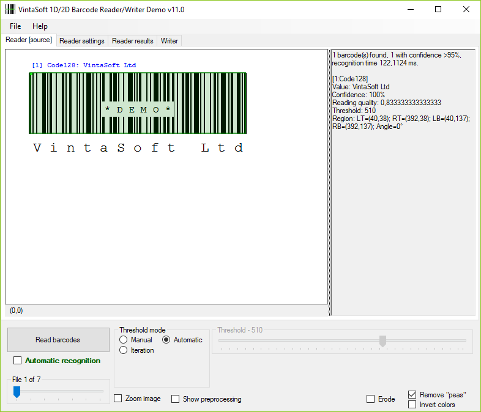

# VintaSoft WinForms Barcode Reader / Writer Demo

This C# project uses <a href="https://www.vintasoft.com/vsbarcode-dotnet-index.html">VintaSoft Barcode .NET SDK</a> and demonstrates how to recognize barcodes in images and  generate barcode images. Project provides advanced barcode recognition and generation settings. Also project outputs extended barcode recognition results with Barcode Print Quality Test data according to ISO 15415 and 15416 standard.


## Screenshot



## Usage
1. Get the 30 day free evaluation license for <a href="https://www.vintasoft.com/vsbarcode-dotnet-index.html" target="_blank">VintaSoft Barcode .NET SDK</a> as described here: <a href="https://www.vintasoft.com/docs/vsbarcode-dotnet/Licensing-Barcode-Evaluation.html" target="_blank">https://www.vintasoft.com/docs/vsbarcode-dotnet/Licensing-Barcode-Evaluation.html</a>

2. Update the evaluation license in "CSharp\MainWindow.xaml.cs" file:
   ```
   Vintasoft.Barcode.BarcodeGlobalSettings.Register("REG_USER", "REG_EMAIL", "EXPIRATION_DATE", "REG_CODE");
   ```

3. Build the project ("BarcodeDemo.Net8.csproj" file) in Visual Studio or using .NET CLI:
   ```
   dotnet build BarcodeDemo.Net8.csproj
   ```

4. Run compiled application and try to generate barcodes.


## Documentation
VintaSoft Barcode .NET SDK on-line User Guide and API Reference for .NET developer is available here: https://www.vintasoft.com/docs/vsbarcode-dotnet/


## Support
Please visit our <a href="https://myaccount.vintasoft.com/">online support center</a> if you have any question or problem.
